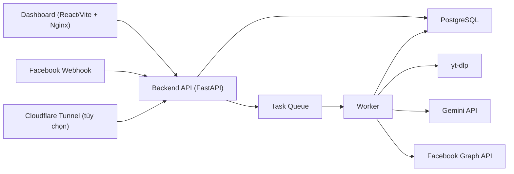

# Social Tool


Hệ thống vận hành Facebook Page theo kiểu “một dashboard để quản lý tất cả”: crawl video từ TikTok và YouTube Shorts, tạo campaign, xếp lịch đăng Facebook Reels, sinh caption bằng AI, phản hồi comment, phản hồi inbox Messenger, quản lý task queue/worker, cấu hình runtime ngay trên giao diện, và theo dõi toàn bộ hệ thống trong một nơi.

README này mô tả đúng trạng thái hiện tại của repo.

## Mục lục

- [Tổng quan](#tổng-quan)
- [Tính năng chính](#tính-năng-chính)
- [Nguồn nội dung hỗ trợ](#nguồn-nội-dung-hỗ-trợ)
- [Kiến trúc hệ thống](#kiến-trúc-hệ-thống)
- [Thành phần và cổng mặc định](#thành-phần-và-cổng-mặc-định)
- [Chạy nhanh với Docker](#chạy-nhanh-với-docker)
- [Thiết lập lần đầu](#thiết-lập-lần-đầu)
- [Kết nối Meta app và nhiều fanpage](#kết-nối-meta-app-và-nhiều-fanpage)
- [Luồng nội dung: TikTok và YouTube Shorts](#luồng-nội-dung-tiktok-và-youtube-shorts)
- [Luồng AI comment và inbox](#luồng-ai-comment-và-inbox)
- [Operator inbox workspace](#operator-inbox-workspace)
- [Runtime config trên dashboard](#runtime-config-trên-dashboard)
- [Biến môi trường nên giữ ngoài UI](#biến-môi-trường-nên-giữ-ngoài-ui)
- [Triển khai Docker production](#triển-khai-docker-production)
- [API chính](#api-chính)
- [Cấu trúc thư mục](#cấu-trúc-thư-mục)
- [Kiểm tra chất lượng](#kiểm-tra-chất-lượng)
- [FAQ](#faq)
- [Tác giả](#tác-giả)
- [Ủng hộ qua MoMo](#ủng-hộ-qua-momo)

## Tổng quan

Mục tiêu của dự án:

- lấy video từ TikTok hoặc YouTube Shorts theo campaign
- chuẩn hóa nguồn nội dung và đẩy video vào hàng chờ đăng Facebook Reels
- dùng AI để hỗ trợ caption, comment và inbox
- quản lý nhiều fanpage dưới cùng một app Meta
- cho operator xử lý các cuộc chat cần người thật ngay trên dashboard
- theo dõi worker, task queue, health, event và runtime config trong cùng một giao diện

Hệ thống này không chỉ là tool đăng bài. Nó là một stack vận hành fanpage gồm content pipeline, AI pipeline, operator inbox và giám sát hệ thống.

## Tính năng chính

- Dashboard React + Tailwind, chia khu rõ ràng để vận hành thực tế.
- Backend FastAPI cho auth, webhook, API và runtime config.
- Worker riêng để xử lý sync campaign, retry, AI reply và scheduler.
- Crawl TikTok và YouTube Shorts bằng `yt-dlp`.
- Campaign queue và video queue, có retry, priority, chỉnh caption.
- Prompt AI riêng theo từng fanpage cho comment và inbox.
- Conversation memory cho inbox:
  - lịch sử gần
  - summary
  - intent
  - customer facts
  - handoff sang operator
- Operator inbox workspace:
  - danh sách conversation
  - trạng thái `ai_active`, `operator_active`, `resolved`
  - trả lời thủ công ngay trên UI
  - link mở thẳng cuộc chat trên Facebook
- Import nhiều fanpage từ một app Meta bằng `User Access Token`.
- Làm mới token fanpage hàng loạt.
- Xóa fanpage an toàn, chặn xóa nếu vẫn còn campaign dùng tới.
- Runtime config trực tiếp trên dashboard, đồng thời sinh lại `backend/runtime.env`.
- Health check sâu hơn cho database, worker, yt-dlp, Facebook Graph, Gemini và task queue.
- Docker stack đã hardening ở mức production nhỏ: restart policy, healthcheck, log rotation, frontend Nginx static.

## Nguồn nội dung hỗ trợ

### Đang hỗ trợ

- TikTok video:
  - `https://www.tiktok.com/@creator/video/...`
- TikTok profile:
  - `https://www.tiktok.com/@creator`
- TikTok shortlink:
  - `https://vt.tiktok.com/...`
  - `https://vm.tiktok.com/...`
- YouTube Shorts đơn:
  - `https://www.youtube.com/shorts/...`
- YouTube Shorts feed:
  - `https://www.youtube.com/@creator/shorts`
  - `https://www.youtube.com/channel/.../shorts`
  - `https://www.youtube.com/user/.../shorts`
  - `https://www.youtube.com/c/.../shorts`

### Chưa hỗ trợ

- `https://www.youtube.com/watch?v=...`
- `https://youtu.be/...`
- playlist YouTube thường không phải Shorts feed

## Kiến trúc hệ thống



Ý nghĩa:

- `frontend` chỉ là giao diện vận hành.
- `backend` nhận request, auth, webhook, health, runtime config.
- `worker` mới là nơi chạy job nền thật.
- `db` lưu campaign, video, user, task, log, settings, conversation.
- `tunnel` chỉ là lựa chọn nhanh để public webhook khi chưa có reverse proxy/domain riêng.

## Thành phần và cổng mặc định

| Service | Vai trò | Port host |
| --- | --- | --- |
| `db` | PostgreSQL lưu dữ liệu vận hành | `5432` |
| `backend` | API, auth, webhook, health, config | `8000` |
| `worker` | sync campaign, retry, AI jobs, scheduler | không public |
| `frontend` | dashboard production qua Nginx | `5173 -> 80` |
| `tunnel` | Cloudflare Tunnel cho webhook | không public |

Truy cập sau khi chạy:

- Dashboard: [http://localhost:5173](http://localhost:5173)
- API docs: [http://localhost:8000/docs](http://localhost:8000/docs)
- Health nhanh: [http://localhost:8000/health](http://localhost:8000/health)

## Chạy nhanh với Docker

Yêu cầu:

- Docker Desktop
- Docker Compose
- Nếu dùng AI thật: `GEMINI_API_KEY`
- Nếu dùng webhook thật: domain HTTPS public hoặc Cloudflare Tunnel

Khởi động stack cơ bản:

```bash
docker compose up -d --build db backend worker frontend
```

Nếu muốn public webhook bằng tunnel:

```bash
docker compose up -d --build db backend worker frontend tunnel
```

Tài khoản mặc định lần đầu:

- username: `admin`
- password: `admin123`

Lưu ý quan trọng cho clone mới:

- `docker-compose.yml` đã fallback sang `backend/runtime.env.example` nếu `backend/runtime.env` chưa tồn tại
- vì vậy clone mới sẽ không còn lỗi thiếu `backend/runtime.env`

## Thiết lập lần đầu

### 1. Chạy stack

```bash
docker compose up -d --build db backend worker frontend
```

### 2. Đăng nhập dashboard

Vào [http://localhost:5173](http://localhost:5173) bằng:

- `admin`
- `admin123`

### 3. Đổi mật khẩu admin

Vào khu `Bảo mật` và đổi ngay mật khẩu mặc định.

### 4. Cấu hình runtime trên dashboard

Điền ít nhất:

- `BASE_URL`
- `FB_VERIFY_TOKEN`
- `FB_APP_SECRET`
- `GEMINI_API_KEY`
- `TUNNEL_TOKEN` nếu dùng tunnel

### 5. Kết nối fanpage

Khuyến nghị:

1. dán `User Access Token` của app Meta
2. bấm `Tải danh sách fanpage`
3. chọn các page cần dùng
4. bấm `Import fanpage đã chọn`

Fallback:

- nhập tay `page_id`, `page_name`, `Page Access Token`

### 6. Kiểm tra webhook và page subscription

Sau khi lưu page:

- bấm kiểm tra token
- bấm đăng ký page vào app
- xác nhận page đang subscribe `feed + messages`

### 7. Tạo campaign đầu tiên

- dán link TikTok hoặc YouTube Shorts
- tạo campaign
- bấm sync
- kiểm tra video queue
- chỉnh caption nếu cần

## Kết nối Meta app và nhiều fanpage

Hệ thống hiện hỗ trợ mô hình:

- một app Meta
- nhiều fanpage
- mỗi page lưu riêng `page_id`, `page_name`, `Page Access Token`, prompt AI, trạng thái automation

### Luồng khuyến nghị

Sử dụng `User Access Token` để:

- tải danh sách page từ app Meta
- import nhiều page cùng lúc
- làm mới `Page Access Token` hàng loạt cho page đã có

### Khi nào dùng gì

| Token | Dùng cho việc gì |
| --- | --- |
| `User Access Token` | tải danh sách page quản lý, import nhiều page, refresh page token |
| `Page Access Token` | comment, inbox, post video, webhook/page action thật |

### Quản lý fanpage trên dashboard

Bạn có thể:

- import page hàng loạt
- validate từng page
- subscribe page vào app
- refresh token page hàng loạt
- xóa page đã thêm

Hệ thống sẽ chặn xóa nếu page vẫn đang được campaign sử dụng.

## Luồng nội dung: TikTok và YouTube Shorts

1. Tạo campaign với một URL nguồn.
2. Backend dùng source resolver để xác định:
   - TikTok video/profile/shortlink
   - YouTube Shorts đơn/feed
3. Worker sync campaign.
4. `yt-dlp` lấy metadata và chuẩn hóa về entry chung.
5. Mỗi entry hợp lệ tạo thành `video` trong queue, có `source_platform` và `source_kind`.
6. Worker tải file video vào `downloads`.
7. Video được xếp lịch đăng, retry hoặc generate caption khi cần.

### Những gì dashboard hiển thị rõ

- campaign source platform
- source kind
- filter TikTok vs YouTube Shorts
- thống kê nguồn trong `Tổng quan`, `Chiến dịch`, `Lịch đăng`
- biểu đồ xu hướng 7 ngày cho từng nguồn

## Luồng AI comment và inbox

### Comment

1. Facebook gửi event `feed`.
2. Backend verify chữ ký webhook.
3. Log comment vào `interaction_logs`.
4. Nếu page bật auto-reply comment, backend tạo task.
5. Worker gọi AI và gửi reply qua Facebook Graph API.

### Inbox

1. Facebook gửi event `messages`.
2. Backend lưu `inbox_message_logs`.
3. Hệ thống kiểm tra:
   - page có bật inbox AI không
   - có đang trong khung giờ cho phép không
   - có dính cooldown theo sender không
   - conversation có đang handoff cho operator không
4. Nếu hợp lệ, tạo task `message_reply`.
5. Worker dựng ngữ cảnh:
   - lịch sử chat gần
   - summary cuộc trò chuyện
   - intent
   - customer facts
6. AI trả structured output:
   - `reply`
   - `summary_update`
   - `intent`
   - `customer_facts`
   - `handoff`
7. Hệ thống cập nhật conversation state và gửi phản hồi nếu còn ở chế độ AI.

## Operator inbox workspace

Khu `Tin nhắn AI` hiện không còn là log đơn thuần, mà là một mini inbox cho operator.

### Những gì có sẵn

- danh sách conversation theo `conversation_id`
- filter:
  - `Tất cả`
  - `Cần operator`
  - `AI đang xử lý`
  - `Đã xử lý`
- panel chi tiết conversation
- timeline chat
- `summary`, `intent`, `customer_facts`
- link mở thẳng cuộc chat trên Facebook
- assign operator
- note nội bộ
- form phản hồi thủ công ngay trên dashboard

### Trạng thái cuộc trò chuyện

- `ai_active`: AI vẫn được phép trả lời
- `operator_active`: đã handoff, AI dừng trả lời
- `resolved`: operator đã xử lý xong

### Quy tắc hiện tại

- nếu conversation đã chuyển operator, AI không phản hồi nữa
- operator có thể trả lời trực tiếp trên UI
- khi đánh dấu đã xử lý, conversation ra khỏi danh sách cần xử lý
- nếu khách nhắn lại sau khi `resolved`, hệ thống có thể mở lại conversation theo logic hiện tại của backend

## Runtime config trên dashboard

Những biến có thể sửa trực tiếp trên UI:

| Biến | Vai trò | Ghi chú |
| --- | --- | --- |
| `BASE_URL` | URL public của hệ thống | áp dụng ngay |
| `FB_VERIFY_TOKEN` | verify webhook Facebook | áp dụng ngay |
| `FB_APP_SECRET` | verify chữ ký webhook POST | áp dụng ngay |
| `GEMINI_API_KEY` | AI caption/comment/inbox | áp dụng ngay |
| `TUNNEL_TOKEN` | token Cloudflare Tunnel | cần recreate `tunnel` |

Cách hoạt động:

1. Dashboard lưu giá trị vào database.
2. Backend mã hóa secret cần bảo vệ.
3. Backend sinh lại `backend/runtime.env`.
4. `backend`, `worker`, `system overview` và health checks dùng lại các giá trị này.

## Biến môi trường nên giữ ngoài UI

Các biến sau vẫn nên do tầng triển khai quản lý:

| Biến | Vai trò |
| --- | --- |
| `DATABASE_URL` | kết nối PostgreSQL |
| `JWT_SECRET` | ký JWT |
| `TOKEN_ENCRYPTION_SECRET` | mã hóa secret lưu DB |
| `AUTH_TOKEN_EXPIRE_MINUTES` | thời hạn token |
| `DEFAULT_ADMIN_USERNAME` | bootstrap admin |
| `ADMIN_PASSWORD` | bootstrap password |
| `AUTO_CREATE_SCHEMA` | auto tạo schema |
| `SCHEDULER_ENABLED` | bật/tắt scheduler |
| `APP_ROLE` | `api` hoặc `worker` |
| `TASK_RETRY_BASE_SECONDS` | retry task queue |
| `TASK_RETRY_MAX_SECONDS` | trần retry task queue |
| `TASK_LOCK_STALE_SECONDS` | phát hiện task `processing` kẹt |
| `EXTERNAL_HTTP_TIMEOUT` | timeout gọi dịch vụ ngoài |
| `HTTP_RETRY_ATTEMPTS` | số lần retry HTTP |
| `HTTP_RETRY_BASE_SECONDS` | backoff HTTP |
| `HTTP_RETRY_MAX_SECONDS` | trần backoff HTTP |
| `LOG_LEVEL` | mức log |

Xem mẫu đầy đủ tại [`.env.example`](./.env.example) và [`backend/runtime.env.example`](./backend/runtime.env.example).

## Triển khai Docker production

### Những gì đã harden trong `docker-compose.yml`

- `restart: unless-stopped`
- `init: true`
- `stop_grace_period` cho các service chính
- healthcheck cho:
  - `db`
  - `backend`
  - `worker`
  - `frontend`
- log rotation Docker:
  - `max-size=20m`
  - `max-file=5`
- `frontend` là image production multi-stage, serve static bằng Nginx

### Frontend production runtime

Frontend không còn chạy Vite dev server trong container production.

Hiện tại:

- stage build: `node:20-alpine`
- stage runtime: `nginx:1.27-alpine`
- Nginx serve `dist/`
- proxy `/api` sang `backend:8000`
- proxy `/downloads` sang `backend:8000/downloads`
- giữ route SPA qua `try_files ... /index.html`

### Checklist deploy

Trước khi deploy:

```bash
python -m compileall backend/app backend/alembic
python -m pytest -q backend/tests
cd frontend && npm run lint && npm run build
docker compose config
```

Khi deploy:

```bash
docker compose up -d --build db backend worker frontend
```

Nếu đổi `TUNNEL_TOKEN`:

```bash
docker compose up -d --force-recreate tunnel
```

Theo dõi sau deploy:

```bash
docker compose logs -f backend worker frontend
```

Kiểm tra thêm:

- `GET /health`
- `GET /system/health`
- dashboard `Tổng quan`
- một campaign sync thật
- một comment thật
- một inbox thật

## API chính

### Auth

- `POST /auth/login`
- `GET /auth/me`
- `POST /auth/change-password`

### Users

- `GET /users/`
- `POST /users/`
- `PATCH /users/{user_id}`
- `POST /users/{user_id}/reset-password`
- `DELETE /users/{user_id}`

### Facebook pages

- `POST /facebook/config`
- `POST /facebook/config/discover-pages`
- `POST /facebook/config/import-pages`
- `POST /facebook/config/refresh-pages`
- `GET /facebook/config`
- `DELETE /facebook/config/{page_id}`
- `PATCH /facebook/config/{page_id}/automation`
- `GET /facebook/config/{page_id}/validate`
- `POST /facebook/config/{page_id}/subscribe-messages`

### Campaigns

- `POST /campaigns/`
- `GET /campaigns/`
- `POST /campaigns/{campaign_id}/sync`
- `POST /campaigns/{campaign_id}/pause`
- `POST /campaigns/{campaign_id}/resume`
- `DELETE /campaigns/{campaign_id}`
- `GET /campaigns/stats`
- `GET /campaigns/videos`
- `POST /campaigns/videos/{video_id}/priority`
- `PATCH /campaigns/videos/{video_id}/caption`
- `POST /campaigns/videos/{video_id}/generate-caption`
- `POST /campaigns/videos/{video_id}/retry`

### Webhooks và inbox workspace

- `GET /webhooks/fb`
- `POST /webhooks/fb`
- `GET /webhooks/logs`
- `GET /webhooks/messages`
- `GET /webhooks/conversations`
- `GET /webhooks/conversations/{conversation_id}`
- `PATCH /webhooks/conversations/{conversation_id}`
- `POST /webhooks/conversations/{conversation_id}/reply`
- `PATCH /webhooks/messages/{conversation_id}/handoff`

### System

- `GET /system/overview`
- `GET /system/health`
- `GET /system/runtime-config`
- `PUT /system/runtime-config`
- `GET /system/tasks`
- `GET /system/events`
- `GET /system/workers`
- `POST /system/workers/cleanup`

Schema chi tiết có tại [http://localhost:8000/docs](http://localhost:8000/docs).

## Cấu trúc thư mục

```text
.
├── backend/
│   ├── alembic/                  # migration database
│   ├── app/
│   │   ├── api/                  # auth, users, campaigns, facebook, webhooks, system
│   │   ├── core/                 # config, db, time
│   │   ├── models/               # ORM models
│   │   ├── services/             # AI, Facebook Graph, crawler, runtime config, queue, health
│   │   └── worker/               # worker loop, scheduler, task handlers, healthcheck
│   ├── tests/                    # pytest backend
│   └── runtime.env               # file runtime sinh từ dashboard
├── frontend/
│   ├── src/
│   │   ├── App.jsx               # dashboard chính
│   │   └── index.css             # theme và style
│   ├── Dockerfile
│   └── nginx.conf
├── database/                     # volume PostgreSQL local
├── videos_storage/               # video tải tạm
├── downloads/                    # artifacts phục vụ backend nếu có
├── docs/
│   ├── dashboard-layout.svg
│   └── momo-qr.png
├── docker-compose.yml
├── .env.example
└── README.md
```

## Kiểm tra chất lượng

### Backend

```bash
cd backend
python -m compileall app alembic
python -m pytest -q tests
```

### Frontend

```bash
cd frontend
npm run lint
npm run build
```

### Docker config

```bash
docker compose config
```

## FAQ

### Clone mới bị lỗi thiếu `backend/runtime.env`?

Không còn nữa nếu dùng bản mới của repo. Compose sẽ fallback sang `backend/runtime.env.example`.

Nếu muốn tạo file thật thủ công:

```bash
copy .env.example backend\runtime.env
```

### Có bắt buộc dùng Cloudflare Tunnel không?

Không. Nếu bạn đã có domain và reverse proxy HTTPS, chỉ cần cấu hình `BASE_URL` đúng là được.

### Có thể dùng một app Meta cho nhiều page không?

Có. Đây là luồng khuyến nghị hiện tại:

- dán `User Access Token`
- tải danh sách page
- chọn nhiều page
- import vào hệ thống

### `Page Access Token` có dùng để liệt kê tất cả page được không?

Không. Nó chỉ dùng tốt cho đúng một page. Muốn tải danh sách nhiều page, phải dùng `User Access Token`.

### Vì sao comment hoặc inbox không đổ vào hệ thống?

Thường do một trong các nguyên nhân:

- `BASE_URL` chưa public đúng
- webhook Meta chưa trỏ đúng `/webhooks/fb`
- page chưa subscribe vào app
- app chưa subscribe `feed` hoặc `messages`
- `FB_APP_SECRET` sai hoặc thiếu
- token page sai loại hoặc hết hạn

### Vì sao YouTube Shorts hoặc TikTok sync bị chậm?

Nguyên nhân thường nằm ở:

- nguồn gốc video chậm từ nền tảng
- `yt-dlp` xử lý feed lớn
- mạng ra ngoài chậm
- worker đang có nhiều task khác

Nên kiểm tra:

- `system/health`
- `tasks`
- log `worker`
- dependency `yt_dlp`

### Vì sao inbox có log nhưng AI không trả lời?

Kiểm tra:

- page đã bật inbox auto-reply chưa
- có đang ngoài khung giờ không
- sender có đang trong cooldown không
- conversation có đang `operator_active` không
- worker có đang sống không
- `GEMINI_API_KEY` có hợp lệ không

### Vì sao sau khi chuyển operator thì AI không trả lời nữa?

Đó là hành vi đúng. Khi conversation đã `operator_active`, AI sẽ dừng phản hồi cho tới khi operator xử lý xong hoặc bật lại AI.

### Có thể mở thẳng cuộc chat trên Facebook từ dashboard không?

Có. Conversation hiện có `facebook_thread_url` và UI có link `Mở trên Facebook`.

## Tác giả


- Kênh hỗ trợ: `MoMo`
- Ghi chú chuyển khoản: `Ung ho Social Tool`
